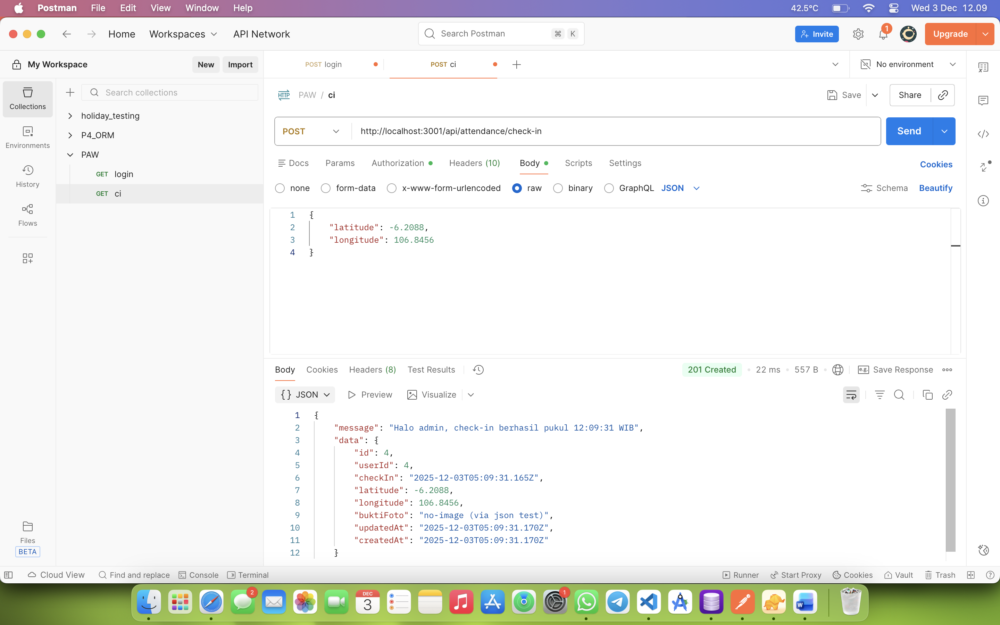
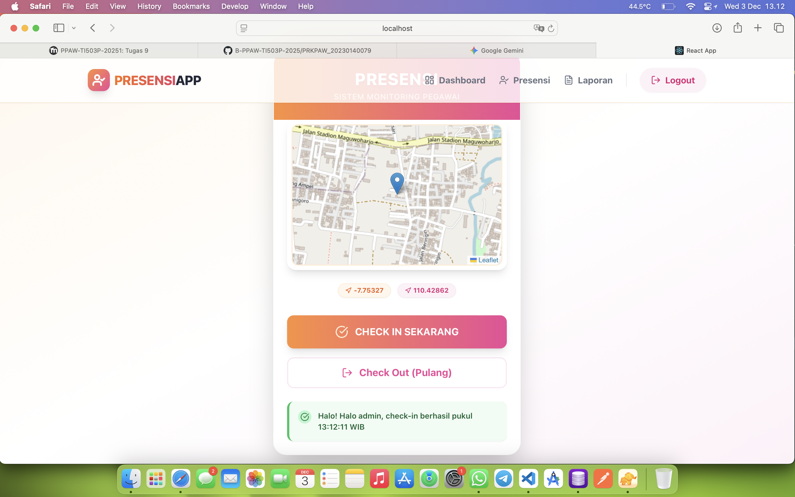
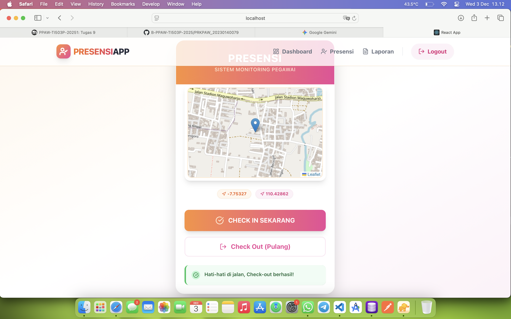
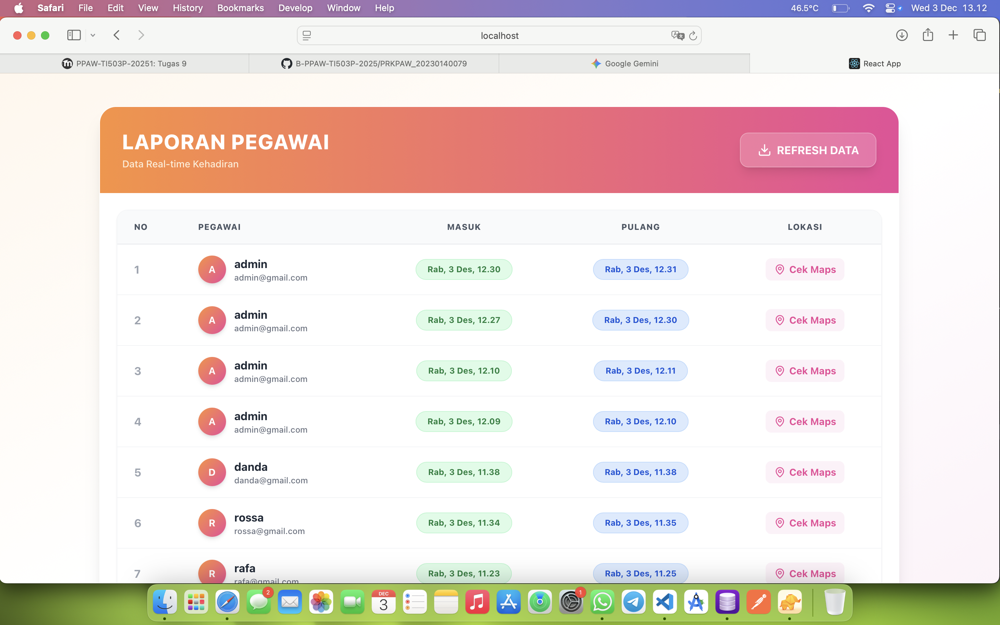
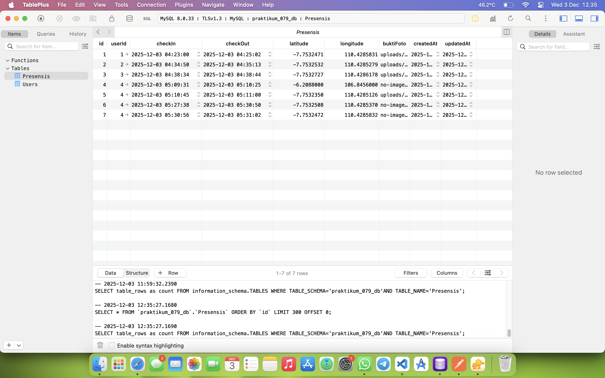

## TUGAS 9

## 1. Tampilan Endpoint presensi/check-in dengan menggunakan bearer token dan body latitude, longitude

---

## 2. Tampilan halaman presensi dengan menampilkan maps OSM saat check in dan check out

---

## 3. Tampilan halaman report yg berisi data presensi dari semua user

---

## 4. Screenshot tabel presensi di database
